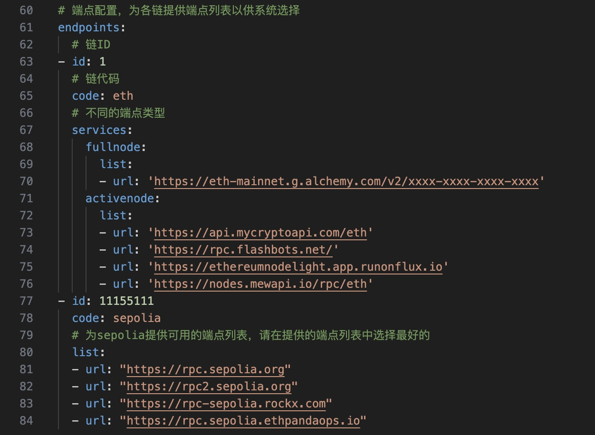
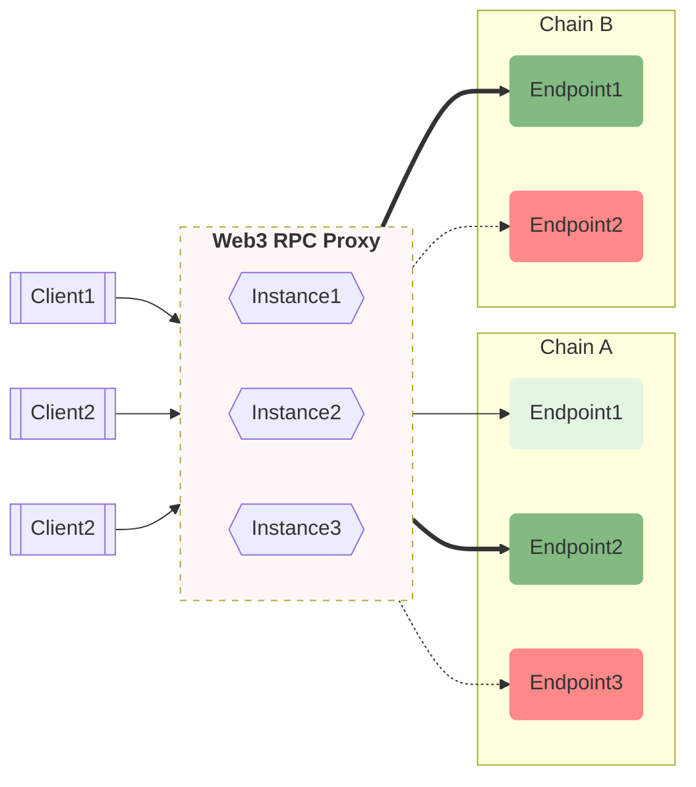

<div align="center" id="top">

&#xa0;

</div>

<h1 align="center">Web3 RPC Proxy</h1>


<br>

## :dart: 介绍

Web3 RPC Proxy 是一个支持集群部署的 EVM 区块链访问的代理中间件，旨在为用户提供最优质、最稳定、最新块高代理访问。

<br>

## :sparkles: 特性

- :zap: 高并发，快速访问
- :dizzy: 灵活支持多链
- :mag: 高效的端点选择
- :construction_worker: 支持分布式部署
- :chart_with_upwards_trend: 支持完善的报表

### 功能

- 租户隔离
- 多桶限流
- 请求结果缓存复用
- WSS 端点配置
- 动态端点配置更新
- JSON-RPC API schema 验证
- 多端点的交替重试
- Prometheus 指标
- Grafana 监控报表

<br>

## :rocket: 部署

```bash
# 构建docker镜像
$ docker build ./Dockerfile -t web3rpcproxy:latest

# 运行镜像
$ docker run -p 8080:8080 -d web3rpcproxy:latest
```

或者

```bash
# 通过 docker compose 起点服务
$ docker compose up -d
```

通过以下环境变量修改系统配置
- `WEB3RPCPROXY_APP_HOST` 用于设置服务的 host 和 port, 默认`0.0.0.0:8080`
- `WEB3RPCPROXY_ETCD_CONFIG_ENDPOINTS` 设置 ETCD 的 endpoints
- `WEB3RPCPROXY_ETCD_SETUP_CONFIG_FILE` 指定 ETCD 上系统启动配置的路径
- `WEB3RPCPROXY_ETCD_ENDPOINTS_CONFIG_FILE` 指定 ETCD 上各链的端点配置的路径

### 依赖

- PostgreSQL
  依赖[Tenant](internal/database/schema/tenant.go)表
- Redis
  用于服务中的Tenant的分布式限流功能
- Amqp，可选
  结束后，将请求信息发布到mq中

### Grafana 报表
导入[Grafana 模板文件](config/grafana.json)

## :bulb: 使用介绍

使用方法很简单，对某条链发起 JSON-RPC 请求即可。
```bash
$ curl --location --request POST 'https://localhost:8080/{{CHAIN}}' \
--header 'Content-Type: application/json' \
--data-raw '[
    {
        "jsonrpc": "2.0",
        "id": 1,
        "method": "net_version",
        "params": []
    },
    {
        "jsonrpc": "2.0",
        "id": 2,
        "method": "eth_blockNumber",
        "params": []
    }
]'
```

- `CHAIN`: 必传
	表示某条区块链的 Chain ID 或代码，参见下面的 YAML 配置文件。

### 请求参数:
- `x_api_key`: 必传
  客户端访问服务时必须带上 API key，否则将被 403 拒绝。可以用 `X-API-KEY` 请求头代替。
- `x_api_bucket`: 选传
  允许客户端根据情况指定不同的 bucket，将不同值放入不同的桶中分别计算限流请求数。可以用 `X-API-BUCKET` 请求头代替，如将不同的链 ID 作为 bucket 值，传入后将会隔离计数限流。
- `cache`: 选传，默认`true`  
  是否使用缓存，可选值：`true`，`false`
- `timeout`:  选传，默认`30000`ms  
  超时时间，超时后请求返回 `408` 异常
- `attempts`:  选传，默认`0`
  最大重试次数，`0` 即不重试
- `attempt_strategy`:  选传，默认`same`
  应用失败重试选择端点的策略：`same`总是重试相同的端点，`rotation`当有多个可用端点时使其循环交替重试
- `endpoint_type`: 选传，字符串，`default`
	指定选择端点的类型：`default`根据请求方法自动选择最合适的端点类型，`fullnode`， `activenode`


JSON-RPC 调用体详情见 [JSON-RPC API METHODS](https://ethereum.org/en/developers/docs/apis/json-rpc/#json-rpc-methods)

<br>

## :wrench: 配置
见[默认配置文件](config/default.yaml)

<br>

## :technologist: 开发

### 开始项目
```bash
# 克隆项目
$ git clone https://github.com/DODOEX/web3-rpc-proxy

# 进入项目文件夹
$ cd web3-rpc-proxy

# 安装项目依赖
go mod download

# 启动项目
go run ./cmd/main.go
```

### 本地调试

在文件夹下添加配置`config/local.yaml`，以覆盖`config/default.yaml`用于本地开发调试。
> [!NOTE]
> 各链的端点配置应写在`endpoints`配置项下。



### 技术

项目使用以下技术：

- [Fasthttp](https://github.com/valyala/fasthttp)
- [PostgreSQL](https://www.postgresql.org)

<br>

### 架构



## :speech_balloon: 常见问题
- 服务为什么选择了不在配置里的端点？   
  多个独立的服务使用不同`endpoints.yaml`配置和相同的redis，其客户端使用缓存参数时会出现这种情况。
  建议独立的服务应使用独立的配置和redis。
- 服务如何选择端点？  
  根据`WEB3RPCPROXY_ETCD_ENDPOINTS_CONFIG_FILE`配置结合examination_results表的端点状态选择端点.
- 配置优先级是？  
  配置优先级是：`local < env < etcd < 租户配置`

<br>

## :busts_in_silhouette: Contribute
如果您想为 Web3 RPC Proxy 项目做出贡献：

解决问题：查找并解决项目中的问题（issue）。  
编写文档：完善和编写项目的相关文档。  
编写测试代码：为项目编写和优化测试代码。  

如果您想表示感谢或支持 Web3 RPC Proxy 项目的持续开发，可以通过以下方式：

为项目添加一个 GitHub Star。
支持项目，捐赠一杯茶。

## :memo: License

This project is under license from MIT. For more details, see the [LICENSE](LICENSE) file.

&#xa0;

<a href="#top">Back to top</a>
